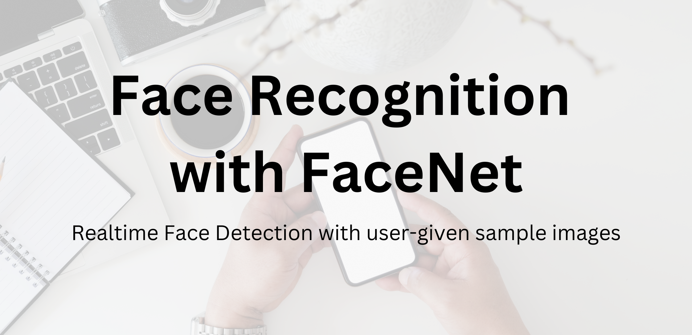
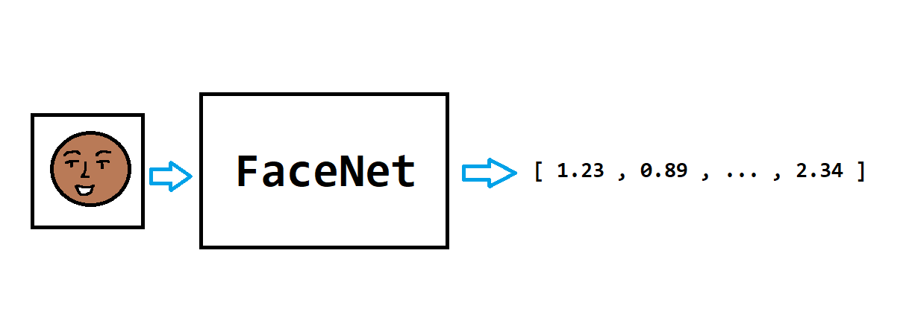
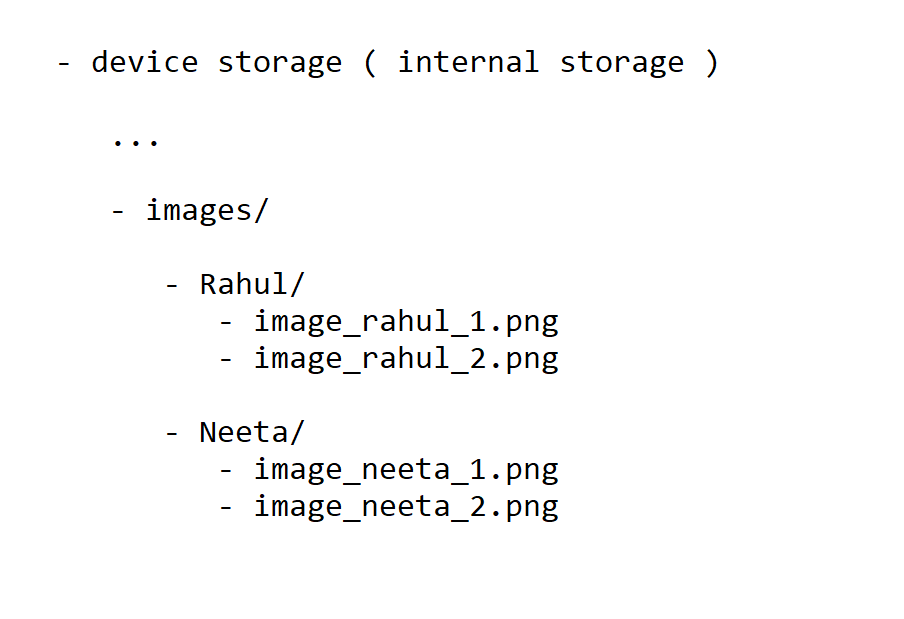
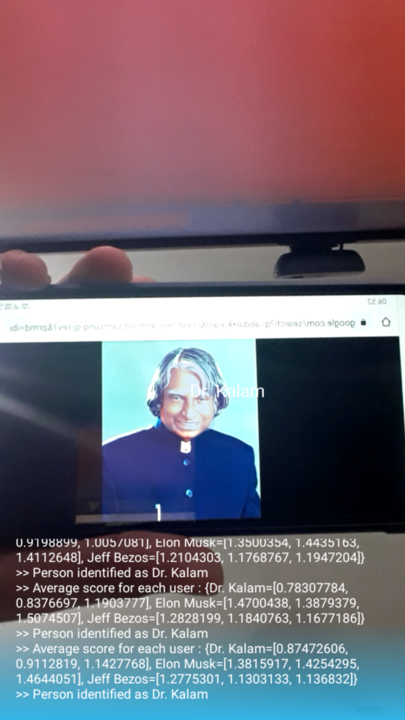

<div align="center">
  <h1>Face Recognition and Classification With FaceNet On Android</h1>
</div>

> **Store images of people who you would like to recognize and the app, using these images, will classify those people. 
We don't need to modify the app/retrain any ML model to add more people ( subjects ) for classification**  



*Message from the developer,*

 > You may also like my latest project -> [**Age + Gender Estimation in Android with TensorFlow**](https://github.com/shubham0204/Age-Gender_Estimation_TF-Android). 
 > I'm open for **freelancing** in Android + ML projects. You may send me an email/message on [**Google Chat**](https://mail.google.com/chat) at **equipintelligence@gmail.com**.
  
## What's New

### Major Updates - July 2021

- We'll now use the `PreviewView` from Camera instead of directly using the `TextureView`. 
  See the [official Android documentation for `PreviewView`](https://developer.android.com/training/camerax/preview)
  
- As of Android 10, apps couldn't access the root of the internal storage directly.
  So, we've implemented [Scoped Storage](https://developer.android.com/about/versions/11/privacy/storage), where the user has to allow the app to use the contents of a particular directory.
  In our case, users now have to choose the `images/` directory manually. See [Grant access to a directory's contents](https://developer.android.com/training/data-storage/shared/documents-files#grant-access-directory).
  
- The feature request [#11](https://github.com/shubham0204/FaceRecognition_With_FaceNet_Android/issues/11) for serializing the 
  image data has been considered now. The app won't load the images everytime so as to ensure a faster start.
  
- The feature request [#6](https://github.com/shubham0204/FaceRecognition_With_FaceNet_Android/issues/6) has also been considered.
  After considering the use of `PreviewView`, the app can now be sed in the landscape orientation.

- The project is now backwards compatible to API level 25. For other details, see 
  the [`build.gradle`](https://github.com/shubham0204/FaceRecognition_With_FaceNet_Android/blob/master/app/build.gradle) file.
  
- The lens facing has been changed to `FRONT` and users won't be able to change the lens facing. The app will open the front 
  camera of the device as a default.
  
- A `TextView` is now added on the screen which logs important information like number of images scanned, similarity score for 
  users, etc.

### June 2021

* The source of the FaceNet model has been changed. We'll now use the FaceNet model 
from [sirius-ai/MobileFaceNet_TF](https://github.com/sirius-ai/MobileFaceNet_TF)
* The project is now backwards compatible to API level 23 ( Android Marshmallow )

```
minSdkVersion 23
```

### December 2020
  
* Lens Facing of the camera can be changed now. A button is provided on the main screen itself.  
* For multiple images for a single user, we compute the score for each image. An average score is computed for each group.
The group with the best score is chosen as the output. See `FrameAnalyser.kt`.

```  
images ->  
    Rahul -> 
         image_rahul_1.png -> score=0.6 --- | average = 0.65 --- |
         image_rahul_2.png -> score=0.5 ----|                    | --- output -> "Rahul"
    Neeta ->                                                     |
         image_neeta_1.png -> score=0.4 --- | average = 0.35 --- |
         image_neeta_2.png -> score=0.3 ----|             
 ```  


* Cosine similarity can be used alongside [L2 norm](https://en.wikipedia.org/wiki/Norm_(mathematics)#Euclidean_norm). See the `metricToBeUsed` variable in `FrameAnalyser.kt`.
* A new parameter has been added in `MainActivity.kt`. The `cropWithBBoxes` argument allows you to run the Firebase MLKit module on the images provided. If you are already providing cropped images in the `images/` folder, set this argument to `false`. On setting the value to `true`, Firebase ML Kit will crop faces from the images and then run the FaceNet model on it.  

---


If you're ML developer, you might have heard about FaceNet, Google's state-of-the-art model for generating face embeddings. In this   
project, we'll use the FaceNet model on Android and generate embeddings ( fixed size vectors ) which hold information of the face.  
  
> The accuracy of the face detection system ( with FaceNet ) may not have a considerable accuracy. Make sure you explore other options as well while considering your app's production.  
  
## The FaceNet Model  



So, the aim of the FaceNet model is to generate a 128 dimensional vector of a given face. It takes in an 160 * 160 RGB image and   
outputs an array with 128 elements. How is it going to help us in our face recognition project?   
Well, the FaceNet model generates similar face vectors for similar faces. Here, by the term "similar", we mean   
the vectors which point out in the same direction.
In this app, we'll generate two such vectors and use a suitable metric to compare them ( either L2norm or cosine similarity ). 
The one which is the closest will form our desired output.  
  
You can download the FaceNet Keras `.h5` file from this [repo](https://github.com/sirius-ai/MobileFaceNet_TF) and TFLite model 
from the [`assets`](https://github.com/shubham0204/FaceRecognition_With_FaceNet_Android/tree/master/app/src/main/assets) folder.
  
## Usage  ( Intended file structure for the app )


  
So, an user can store images in his/her device in a specific folder. If, for instance, the user wants the app to recognize  
two people namely "Rahul" and "Neeta". So the user needs to store the images by creating two directories namely "Rahul" and "Neeta"   
and store their images inside of these directories.  

The app will then process these images and classify these people thereafter. For face recognition, Firebase MLKit is used which   
fetches bounding boxes for all the faces present in the camera frame.  
  
> For better performance, we recommend developers to use more images of the subjects, they need to recognize.

## Working  


  
The app's working is described in the steps below:
  
1. Scan the `images` folder present in the internal storage. Next, parse all the images present within `images` folder and store   
the names of sub directories within `images`. For every image, collect bounding box coordinates ( as a `Rect` ) using MLKit.
   Crop the face from the image ( the one which was collected from user's storage ) using the bounding box coordinates.   
  
2. Finally, we have a list of cropped `Bitmap` of the faces present in the images. Next, feed the cropped `Bitmap` to the FaceNet   
model and get the embeddings ( as `FloatArray` ). Now, we create a `HashMap<String,FloatArray>` object where we store the names of   
the sub directories as keys and the embeddings as their corresponding values. 
   
See [`MainActivity.kt`](https://github.com/shubham0204/FaceRecognition_With_FaceNet_Android/blob/master/app/src/main/java/com/ml/quaterion/facenetdetection/MainActivity.kt) and [`FileReader.kt`](https://github.com/shubham0204/FaceRecognition_With_FaceNet_Android/blob/master/app/src/main/java/com/ml/quaterion/facenetdetection/FileReader.kt) for the code.
  
The above procedure is carried out only on the app's startup. The steps below will execute on each camera frame.  
  
1. Using `androidx.camera.core.ImageAnalysis`, we construct a `FrameAnalyser` class which processes the camera frames. Now, for a   
given frame, we first get the bounding box coordinates ( as a `Rect` ) of all the faces present in the frame. Crop the face from   
the frame using these boxes.  
2. Feed the cropped faces to the FaceNet model to generate embeddings for them. We compare the embedding with a suitable metric and
form clusters for each user. We compute the average score for each cluster. The cluster with the best score is our output.
The final output is then stored as a `Prediction` and passed to the `BoundingBoxOverlay` which draws boxes and   
text.  

See [`FaceNetModel.kt`](https://github.com/shubham0204/FaceRecognition_With_FaceNet_Android/blob/master/app/src/main/java/com/ml/quaterion/facenetdetection/FaceNetModel.kt) and [`FrameAnalyser.kt`](https://github.com/shubham0204/FaceRecognition_With_FaceNet_Android/blob/master/app/src/main/java/com/ml/quaterion/facenetdetection/FrameAnalyser.kt) for the code.
  
## Limitations  
  
Predictions may go wrong as FaceNet does not always produce similar embeddings for the same person. 
Consider the accuracy of the FaceNet model while using it in your apps. In that case, you may learn to use the `FaceNetModel` class separating for using FaceNet in some other tasks.  

## Important Resources  

- [FaceNet: A Unified Embedding for Face Recognition and Clustering](https://arxiv.org/abs/1503.03832)
- [MLKit](https://developers.google.com/ml-kit/vision/face-detection) for face recognition.  
- [TensorFlow Lite Android](https://www.tensorflow.org/lite)  
- [TensorFlow Lite Android Support Library](https://github.com/tensorflow/tensorflow/tree/master/tensorflow/lite/experimental/support/java)  
- [CameraX](https://developer.android.com/training/camerax)

